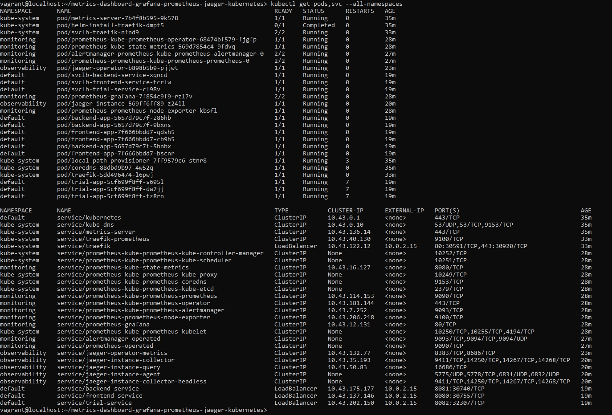
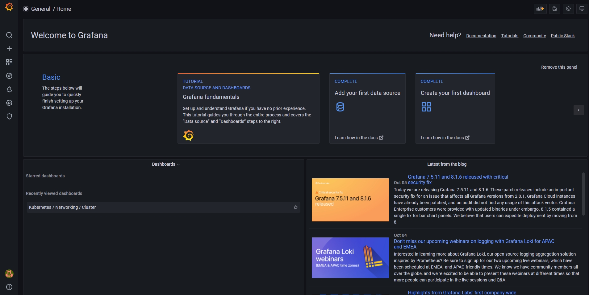
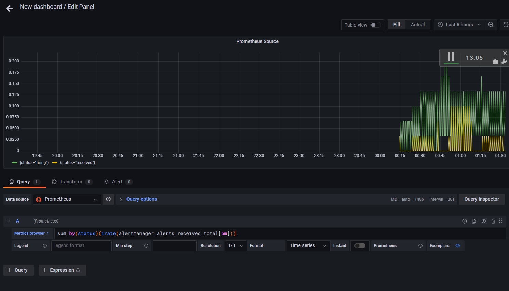
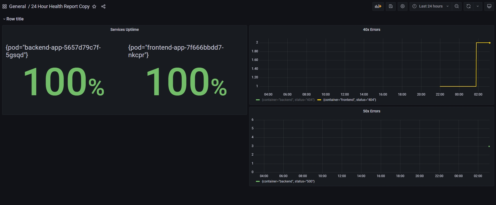
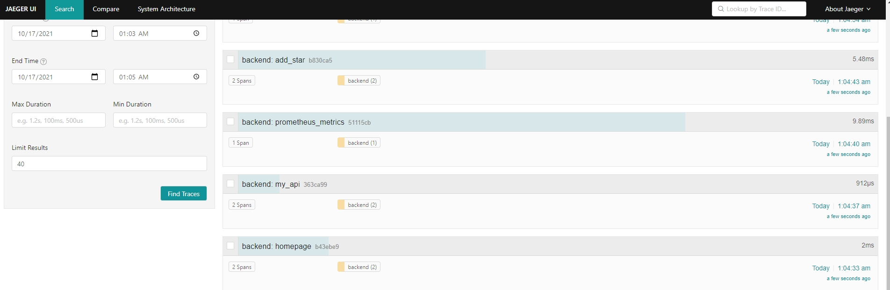
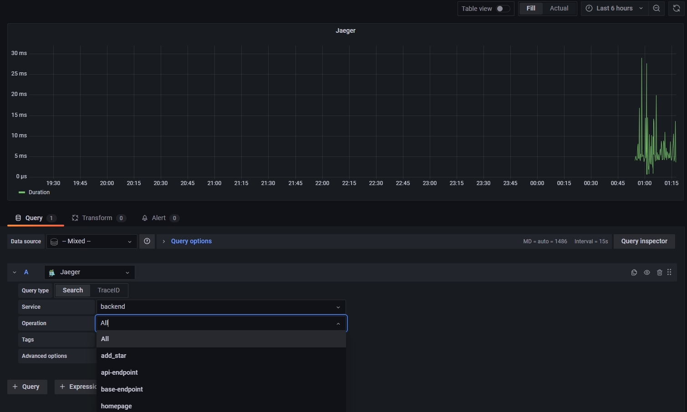

**Note:** For the screenshots, you can store all of your answer images in the `answer-img` directory.

## Verify the monitoring installation

*TODO:* run `kubectl` command to show the running pods and services for all components. Take a screenshot of the output and include it here to verify the installation

## Setup the Jaeger and Prometheus source
*TODO:* Expose Grafana to the internet and then setup Prometheus as a data source. Provide a screenshot of the home page after logging into Grafana.

## Create a Basic Dashboard
*TODO:* Create a dashboard in Grafana that shows Prometheus as a source. Take a screenshot and include it here.

## Describe SLO/SLI
*TODO:* Describe, in your own words, what the SLIs are, based on an SLO of *monthly uptime* and *request response time*.

The most well-known SLIs for the above SLOs would be:
1. 98% website uptime per month
2. 90.5% of requests to backend service would respond in less than 200ms per month

## Creating SLI metrics.
*TODO:* It is important to know why we want to measure certain metrics for our customer. Describe in detail 5 metrics to measure these SLIs. 

1. Uptime or how many percentage of our monthly time the service was in the fully operational state.
2. Latency or the amount of time in ms it takes for a request to be proccessed and returned to the requester.
3. Error rate or the number of errors requests during a month - errors take away from our uptime so we need to monitor them. 
4. Disk, cpu and ram utilization - if either one of those is used at its maximum our response time would decrease due to lack of resources and it may lead to a failure hence also takes away from our uptime.
5. Traffic or the number of HTTP requests per second showing us how highly used our system is. Higher usage means the chance to overstress the system if we are not prepared for the incoming traffic.

## Create a Dashboard to measure our SLIs
*TODO:* Create a dashboard to measure the uptime of the frontend and backend services We will also want to measure to measure 40x and 50x errors. Create a dashboard that show these values over a 24 hour period and take a screenshot.

## Tracing our Flask App
*TODO:*  We will create a Jaeger span to measure the processes on the backend. Once you fill in the span, provide a screenshot of it here.

## Jaeger in Dashboards
*TODO:* Now that the trace is running, let's add the metric to our current Grafana dashboard. Once this is completed, provide a screenshot of it here.

## Report Error
*TODO:* Using the template below, write a trouble ticket for the developers, to explain the errors that you are seeing (400, 500, latency) and to let them know the file that is causing the issue.

TROUBLE TICKET

Name: 500 Server Error on Star endpoint of Backend app

Date: 16/Oct/2021 20:37:10

Subject: Unable to connect to MongoDB

Affected Area: Backend app's /star API endpoint

Severity: High

Description: Star endpoint is accepting a post request but it is unable to connect to the MongoDB database either because the database doesn't exist or the connection is poorly configured

## Creating SLIs and SLOs
*TODO:* We want to create an SLO guaranteeing that our application has a 99.95% uptime per month. Name three SLIs that you would use to measure the success of this SLO.

## Building KPIs for our plan
*TODO*: Now that we have our SLIs and SLOs, create KPIs to accurately measure these metrics. We will make a dashboard for this, but first write them down here.

## Final Dashboard
*TODO*: Create a Dashboard containing graphs that capture all the metrics of your KPIs and adequately representing your SLIs and SLOs. Include a screenshot of the dashboard here, and write a text description of what graphs are represented in the dashboard.  
